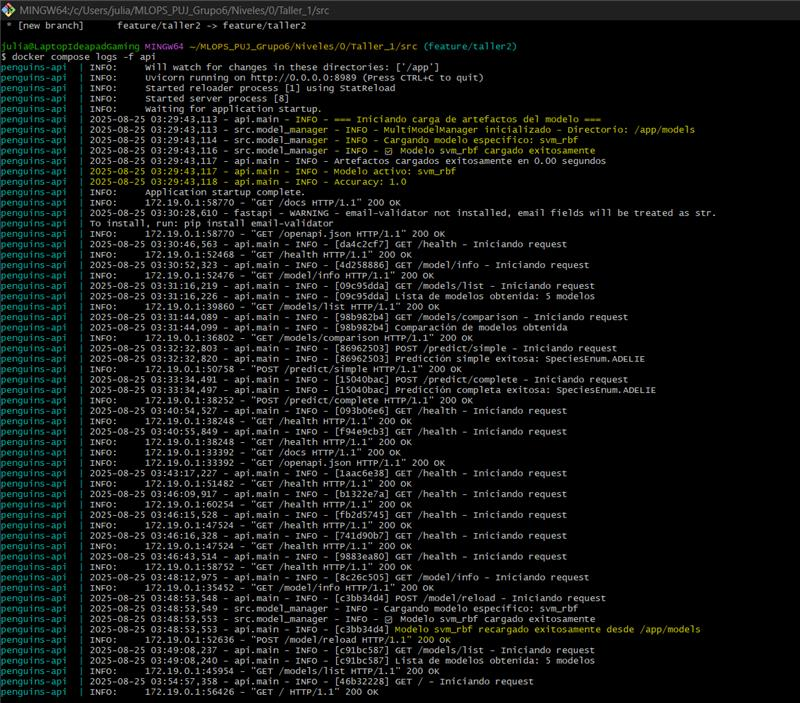
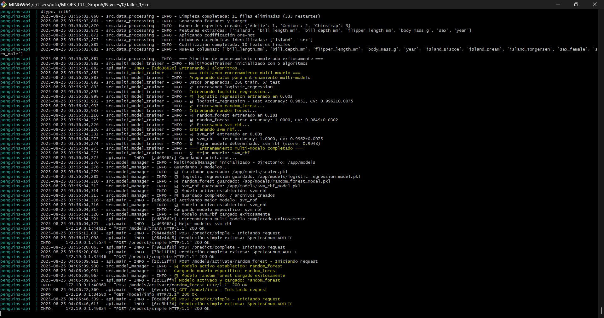

### Estructura de Archivos


### Arquitectura del proyecto

La estructura del proyecto se organizó de manera modular para facilitar el mantenimiento y escalabilidad:

```bash
┌────────────────┐        volumen compartido         ┌───────────────┐
│   JupyterLab    │  /workspace/models  <──────────► │     API        │
│  (entrenamiento)│                                   │ (inferencias) │
└────────────────┘  ▲                                └───────────────┘
                    │
                guarda artefactos
```

JupyterLab: entrena y guarda logistic_regression_model.pkl, scaler.pkl, model_info.json en el volumen compartido.

API (FastAPI): sirve predicciones; puede recargar los artefactos con POST /model/reload sin reiniciar.

### Estructura Relevante

```graphql
.
├── api/
│   ├── main.py                 # FastAPI: endpoints de predicción, health, info y /model/reload
│   └── schemas.py              # Pydantic (v2) - incluye campo "year" y nombres correctos sex_female/sex_male
├── src/
│   ├── data_processing.py      # Pipeline de procesamiento (palmerpenguins + limpieza + OHE)
│   ├── model_training.py       # Entrenamiento, evaluación, metadata
│   └── model_manager.py        # Carga/guardado/validación de artefactos
├── train_model.py              # Script maestro: procesa → entrena → guarda artefactos
├── requirements.txt            # Dependencias; se instalan con uv en los contenedores
├── docker/
│   ├── Dockerfile.api          # Imagen API con uv
│   └── Dockerfile.jupyter      # Imagen JupyterLab con uv
└── docker-compose.yml          # Orquestación: servicios + volumen compartido de modelos
```

### Endpoints principales

GET / – info básica del servicio

GET /health – estado (incluye si modelo/scaler están cargados)

GET /model/info – tipo de modelo, versión, features, métricas

POST /predict/simple – recibe entrada “humana” y hace el encode internamente

Importante: incluye year (int) y sex con valores "Male"/"Female".

POST /predict/complete – entrada ya one-hot

POST /model/reload – recarga artefactos desde MODELS_DIR (volumen compartido)

Swagger UI: http://localhost:8989/docs
ReDoc: http://localhost:8989/redoc

### Funciones principales de los Endpoints
"endpoints": {    "/predict/simple": "Predicción con entrada user-friendly",    "/predict/complete": "Predicción con one-hot encoding explícito",    "/health": "Estado detallado del servicio",    "/model/info": "Información sobre el modelo activo",    "/model/reload": "Recargar modelo activo",    "/models/list": "Listar todos los modelos disponibles",    "/models/activate/{model_name}": "Activar un modelo específico",    "/models/comparison": "Comparación detallada entre modelos",    "/models/train": "Entrenar múltiples modelos",    "/models/{model_name}": "Eliminar un modelo específico",    "/docs": "Documentación interactiva (Swagger UI)",    "/redoc": "Documentación alternativa (ReDoc)"

### Variables de entorno relevantes

MODELS_DIR

En API: /app/models

En Jupyter: /workspace/models

Ambos apuntan al mismo volumen (model_store) para compartir artefactos.

### Requisitos previos

Docker Desktop en Windows con WSL2 backend habilitado.

WSL Ubuntu configurado (usas la terminal de Ubuntu para los comandos).

Puertos libres:

8989 para la API

8888 para Jupyter

### Puesta en marcha

Desde la raíz del proyecto (donde está docker-compose.yml):

```bash
docker compose down -v          # opcional: limpiar
docker compose build            # construye imágenes de API y Jupyter
docker compose up -d            # levanta ambos servicios en segundo plano
docker compose logs -f api      # ver logs de API
docker compose logs -f jupyter  # ver logs de Jupyter

```

Abre Jupyter: http://localhost:8888
(Se ejecuta sin token y como root solo para desarrollo local; si quieres, configura seguridad más adelante.)

Abre la API: http://localhost:8989/docs

### Flujos de prueba
1) Entrenar un modelo desde Jupyter

!python train_model.py --> !python train_multi_models.py
```
Esto:

Procesa datos → entrena → guarda artefactos en /workspace/models (volumen compartido).

Verifica artefactos:
```bash
!ls -lh /workspace/models
 
```Deberias ver: 
 
-rwxr-xr-x 1 root root    7 Aug 25 03:56 active_model.txt
-rwxr-xr-x 1 root root 745K Aug 25 03:42 gradient_boosting_model.pkl
-rwxr-xr-x 1 root root 1.2K Aug 25 03:56 logistic_regression_model.pkl
-rwxr-xr-x 1 root root 3.3K Aug 25 01:19 model_info.json
-rwxr-xr-x 1 root root 7.7K Aug 25 03:56 models_comparison.json
-rwxr-xr-x 1 root root  704 Aug 25 03:56 models_registry.json
-rwxr-xr-x 1 root root 157K Aug 25 03:42 neural_network_model.pkl
-rwxr-xr-x 1 root root 227K Aug 25 03:56 random_forest_model.pkl
-rwxr-xr-x 1 root root 1.3K Aug 25 03:56 scaler.pkl
-rwxr-xr-x 1 root root 9.3K Aug 25 03:56 svm_rbf_model.pkl


### Desarrollo con VS code (WSL)

Abre la carpeta del proyecto en VS Code (WSL).

Edita archivos Python: el contenedor de la API monta ./ en /app, y Uvicorn está con --reload, así que las rutas vivas recargan automáticamente.

Si cambias requirements.txt o Dockerfiles:

```bash
docker compose build api && docker compose restart api
# o para Jupyter:
docker compose build jupyter && docker compose restart jupyter

```
### Troubleshooting

Jupyter se cierra con “Running as root is not recommended”: ya está mitigado con --allow-root en Compose.

Puerto 8989 ocupado:
```bash
sudo lsof -i:8989
kill -9 <PID>

```
/docs no carga: usa /docs (no /doc).

/model/reload no aparece: asegúrate de haber guardado cambios de api/main.py y que Uvicorn hizo reload (o reinicia el servicio API).

### Despliegue de la solución

Verificación del funcionamiento: 


Logs de funcionamiento API:



Validación de los Endpoints de la API:


