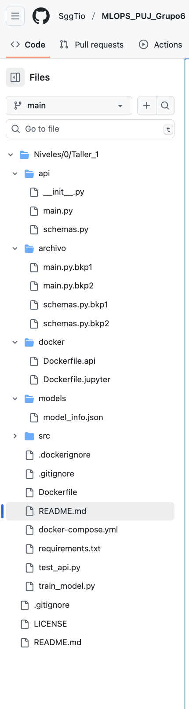

# Taller — Desarrollo en Contenedores (API + Jupyter + uv + Compose)

Este proyecto implementa una API desarrollada con FastAPI para clasificar especies de pingüinos (Palmer Penguins), junto con un entorno de JupyterLab que permite entrenar y guardar nuevos modelos. Ambos servicios comparten un volumen de almacenamiento, lo que permite que los modelos generados desde Jupyter se guarden en una ubicación común. Gracias a esto, la API puede recargar automáticamente los artefactos actualizados sin necesidad de reiniciar su contenedor.

### Estructura de Archivos


### Arquitectura del proyecto

La estructura del proyecto se organizó de manera modular para facilitar el mantenimiento y escalabilidad:

```bash
┌────────────────┐        volumen compartido         ┌───────────────┐
│   JupyterLab    │  /workspace/models  <──────────► │     API        │
│  (entrenamiento)│                                   │ (inferencias) │
└────────────────┘  ▲                                └───────────────┘
                    │
                guarda artefactos
```

JupyterLab: entrena y guarda logistic_regression_model.pkl, scaler.pkl, model_info.json en el volumen compartido.

API (FastAPI): sirve predicciones; puede recargar los artefactos con POST /model/reload sin reiniciar.

### Estructura Relevante

```graphql
.
├── api/
│   ├── main.py                 # FastAPI: endpoints de predicción, health, info y /model/reload
│   └── schemas.py              # Pydantic (v2) - incluye campo "year" y nombres correctos sex_female/sex_male
├── src/
│   ├── data_processing.py      # Pipeline de procesamiento (palmerpenguins + limpieza + OHE)
│   ├── model_training.py       # Entrenamiento, evaluación, metadata
│   └── model_manager.py        # Carga/guardado/validación de artefactos
├── train_model.py              # Script maestro: procesa → entrena → guarda artefactos
├── requirements.txt            # Dependencias; se instalan con uv en los contenedores
├── docker/
│   ├── Dockerfile.api          # Imagen API con uv
│   └── Dockerfile.jupyter      # Imagen JupyterLab con uv
└── docker-compose.yml          # Orquestación: servicios + volumen compartido de modelos
```

### Endpoints principales

GET / – info básica del servicio

GET /health – estado (incluye si modelo/scaler están cargados)

GET /model/info – tipo de modelo, versión, features, métricas

POST /predict/simple – recibe entrada “humana” y hace el encode internamente

Importante: incluye year (int) y sex con valores "Male"/"Female".

POST /predict/complete – entrada ya one-hot

POST /model/reload – recarga artefactos desde MODELS_DIR (volumen compartido)

Swagger UI: http://localhost:8989/docs
ReDoc: http://localhost:8989/redoc

### Variables de entorno relevantes

MODELS_DIR

En API: /app/models

En Jupyter: /workspace/models

Ambos apuntan al mismo volumen (model_store) para compartir artefactos.

### Requisitos previos

Docker Desktop en Windows con WSL2 backend habilitado.

WSL Ubuntu configurado (usas la terminal de Ubuntu para los comandos).

Puertos libres:

8989 para la API

8888 para Jupyter

### Puesta en marcha

Desde la raíz del proyecto (donde está docker-compose.yml):

```bash
docker compose down -v          # opcional: limpiar
docker compose build            # construye imágenes de API y Jupyter
docker compose up -d            # levanta ambos servicios en segundo plano
docker compose logs -f api      # ver logs de API
docker compose logs -f jupyter  # ver logs de Jupyter

```

Abre Jupyter: http://localhost:8888
(Se ejecuta sin token y como root solo para desarrollo local; si quieres, configura seguridad más adelante.)

Abre la API: http://localhost:8989/docs

### Flujos de prueba
1) Entrenar un modelo desde Jupyter

En un notebook de Jupyter (p. ej. notebooks/train_penguins.ipynb), ejecuta:

```python
!python train_model.py
```
Esto:

Procesa datos → entrena → guarda artefactos en /workspace/models (volumen compartido).

Verifica artefactos:
```bash
!ls -lh /workspace/models

```
Deberías ver:

```pgsql
logistic_regression_model.pkl
scaler.pkl
model_info.json
```

### Desarrollo con VS code (WSL)

Abre la carpeta del proyecto en VS Code (WSL).

Edita archivos Python: el contenedor de la API monta ./ en /app, y Uvicorn está con --reload, así que las rutas vivas recargan automáticamente.

Si cambias requirements.txt o Dockerfiles:

```bash
docker compose build api && docker compose restart api
# o para Jupyter:
docker compose build jupyter && docker compose restart jupyter

```
### Troubleshooting

Jupyter se cierra con “Running as root is not recommended”: ya está mitigado con --allow-root en Compose.

Puerto 8989 ocupado:
```bash
sudo lsof -i:8989
kill -9 <PID>

```
/docs no carga: usa /docs (no /doc).

/model/reload no aparece: asegúrate de haber guardado cambios de api/main.py y que Uvicorn hizo reload (o reinicia el servicio API).

### 1. Despliegue del Modelo de Machine Learning 

Módulo de Procesamiento de Datos (data_processing.py) Este módulo encapsula toda la lógica relacionada con la carga, limpieza y transformación de datos del dataset Palmer Penguins. 
• Carga de datos: Lectura y validación inicial del dataset
• Limpieza de datos: Manejo de valores faltantes y detección de outliers
• Transformación de datos: Normalización, encoding de variables
categóricas y feature engineering
• Validación de esquemas: Verificación de la integridad y consistencia de los
datos

Módulo de Entrenamiento del Modelo (model_training.py) Este módulo encapsula toda la lógica relacionada con el entrenamiento, validación
y evaluación del modelo de machine learning. Sus funcionalidades principales son:
• Configuración de algoritmos: Definición e inicialización de modelos de
clasificación
• Entrenamiento: Proceso de ajuste de parámetros usando datos de
entrenamiento
• Validación cruzada: Evaluación robusta del rendimiento del modelo

Módulo de Gestión de Modelos (model_manager.py) Este módulo actúa como el "registry" central de modelos, siendo responsable de la
gestión, persistencia y carga de los artefactos de machine learning. Sus capacidades incluyen:
• Serialización y deserialización: Guardado y carga segura de modelos
entrenados
• Versionado de modelos: Control de versiones para diferentes iteraciones
del modelo
• Gestión de metadata: Almacenamiento de información sobre performance,
fecha de entrenamiento y configuración
• Carga dinámica: Recuperación eficiente de modelos para inferencia en
tiempo real.

### 2. API Rest

La API está construida sobre FastAPI, un framework moderno de alto rendimiento que proporciona validación automática, documentación OpenAPI y tipos asincrónicos nativos. La arquitectura se compone de dos módulos principales:
